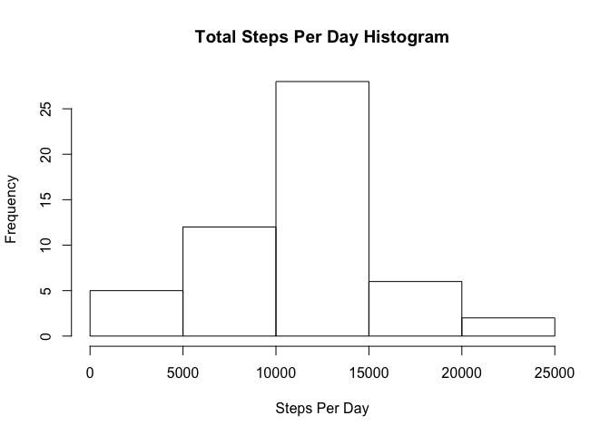
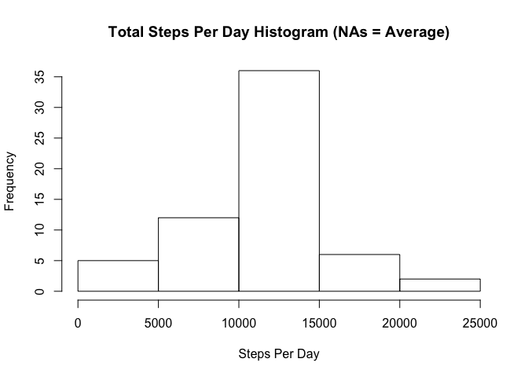
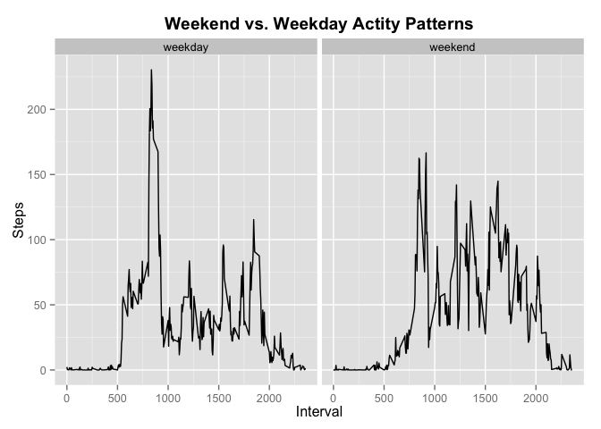

# Reproducible Research: Peer Assessment 1

The following libraries were used to conduct this report:

```r
library(dplyr, warn.conflicts = FALSE)
library(lubridate)
library(ggplot2)
```

The following options were set:

```r
# Disable scientific notation output
options("scipen" = 20)
```

## Loading and preprocessing the data
The data is loaded as CSV. A second dataset is prepared that contains the original data with steps=NA rows removed.


```r
activity <- read.csv("activity.csv", stringsAsFactors = TRUE)
activity_rm.na <- activity[!is.na(activity$steps),]
```

This is how the data looks:

```r
head(activity_rm.na)
```

```
##     steps       date interval
## 289     0 2012-10-02        0
## 290     0 2012-10-02        5
## 291     0 2012-10-02       10
## 292     0 2012-10-02       15
## 293     0 2012-10-02       20
## 294     0 2012-10-02       25
```

## What is mean total number of steps taken per day?

Sum all steps for a given day and render a histogram of it.


```r
total_steps <- activity %>% group_by(date) %>% summarise(Total = sum(steps))
head(total_steps)
```

```
## Source: local data frame [6 x 2]
## 
##         date Total
## 1 2012-10-01    NA
## 2 2012-10-02   126
## 3 2012-10-03 11352
## 4 2012-10-04 12116
## 5 2012-10-05 13294
## 6 2012-10-06 15420
```

```r
steps_histogram <- hist(total_steps$Total, main = "Total Steps Per Day Histogram", xlab = "Steps Per Day")
```

 

```r
total_mean <- mean(total_steps$Total, na.rm = TRUE)
total_median <- median(total_steps$Total, na.rm = TRUE)
```

There are 10766.1886792 **mean** and 10765 **median** total number of steps taken per day.

## What is the average daily activity pattern?

Group data by activity interval and calculate average steps.


```r
interval_avg <- activity_rm.na %>% group_by(interval) %>% summarise(avg = mean(steps))
plot(interval_avg$interval, interval_avg$avg, type = "l", xlab = "Interval", ylab = "Average Steps")
```

 

We can see that during the night everybody is asleep, so not many steps taken. In the morning there is a big spike of steps, everybody is getting ready for and going to work. During the day, there are several small spikes of activity that goes down at the end of the day.

We want to isolate the biggest spike in activity. For that we sort the averaged intervals in descending order to get the maximum value.


```r
interval_sorted <- interval_avg[order(-interval_avg$avg),]
max_interval <- interval_sorted[[1,1]]
max_interval_steps <- round(interval_sorted[[1,2]])
```

The **interval** with the **highest activity** is **835** with **206** steps on average.

## Imputing missing values

As we have seen, the original data set contains a lot of missing values.


```r
nas <- activity[is.na(activity$steps),]
nas_count <- dim(nas)[1]
head(nas)
```

```
##   steps       date interval
## 1    NA 2012-10-01        0
## 2    NA 2012-10-01        5
## 3    NA 2012-10-01       10
## 4    NA 2012-10-01       15
## 5    NA 2012-10-01       20
## 6    NA 2012-10-01       25
```

There are **2304** rows without a value for steps. Let's try to infer those values by filling them with their interval average. (A daily average wouldn't work because there are often simply no values for a given day at all.)


```r
interval_avg <- activity_rm.na %>% group_by(interval) %>% summarise(avg = mean(steps))
get_avg <- function(interval) {
  round(interval_avg[interval_avg$interval == interval,]$avg)
}
activity_avg <- nas
activity_avg$steps <- sapply(nas$interval, get_avg)
```

We now have a dataset where NAs have been replaced by the average interval steps.


```r
head(activity_avg)
```

```
##   steps       date interval
## 1     2 2012-10-01        0
## 2     0 2012-10-01        5
## 3     0 2012-10-01       10
## 4     0 2012-10-01       15
## 5     0 2012-10-01       20
## 6     2 2012-10-01       25
```

We can now join the averaged and the original (without NA) datasets and recalculate the total steps per day.


```r
all_activity <- merge(activity_avg,activity_rm.na, all = TRUE)
all_activity_total <- all_activity %>% group_by(date) %>% summarise(Total = sum(steps))
hist(all_activity_total$Total, main = "Total Steps Per Day Histogram (NAs = Average)", xlab = "Steps Per Day")
```

 

Finally we should compare the total number of steps per day without NA and with averages filled in.


```r
total_avg_mean <- mean(all_activity_total$Total)
total_avg_median <- median(all_activity_total$Total)
```

|        | NAs exluded       | NAs averaged         |
| ------ | ----------------- | -------------------- |
| Mean   | 10766.1886792    | 10765.6393443   |
| Median | 10765  | 10762 |

We can see that **imputing missing values** is **visibile in the histogram**, but has hardly any impact on the mean or the median. The higher frequency in the histogram indicates the move towards the average.

## Are there differences in activity patterns between weekdays and weekends?

First off, we have to determine if a date was on a weekday or weekend.


```r
weekend <- function(weekday) {
  sunday <- 1
  saturday <- 7
  if (weekday == sunday || weekday == saturday) {
    "weekend"
  } else if (weekday > sunday && weekday < saturday) {
    "weekday"
  }
}
activity_weekday <- cbind(Weekday = sapply(wday(ymd(all_activity$date)), weekend), all_activity)
```

This produces a new dataframe with the **Weekday** column.

```r
head(activity_weekday)
```

```
##   Weekday steps       date interval
## 1 weekday     0 2012-10-01        5
## 2 weekday     0 2012-10-01       10
## 3 weekday     0 2012-10-01       15
## 4 weekday     0 2012-10-01       20
## 5 weekday     0 2012-10-01       40
## 6 weekday     0 2012-10-01       50
```

Plot the total average steps per day for a given interval, separated into weekdays and weekends.


```r
activity_weekday_avg <- activity_weekday %>% group_by(interval, Weekday) %>% summarise(avg_steps = mean(steps))

ggplot(data = activity_weekday_avg, aes(x = interval, y = avg_steps)) +
  geom_line() +
  facet_grid(. ~ Weekday) +
  theme(legend.position = "none", plot.title = element_text(vjust=1, face="bold")) +
  xlab("Interval") + ylab("Steps") +
  ggtitle("Weekend vs. Weekday Actity Patterns")
```

 

The graph shows that the average pattern seen above (average daily activity pattern) mostly applies to weekdays. On weekends, the morning spike in steps is significantly lower, but there are several high spikes throughout the day.
